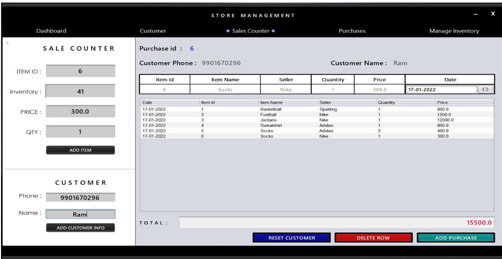
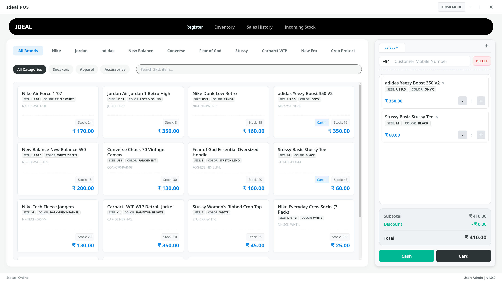

# POS System
I wanted to build a native desktop application that handles basic store operations like inventory, checkout, and receipts without needing an internet connection. 
this project started with a store having issues with its  legacy pos system , having issues with installation across different machines.

## Before and After: The UI.

**Legacy Design (Early Prototype)**

**Current Version**

## Functioning
* **Checkout System:** Has a working cart, a custom numpad as per client request, and handles  discounts.
* **Inventory Management:** A section to add products, track stock levels, and another page to manage suppliers and return shipments.
* **Offline Database:** Uses SQLite, so all the store data is saved directly on the local machine , thinking of adding a cloud upload feature too.

## Tech Stack
* **Frontend:** Standard HTML, CSS, JavaScript, and  jQuery.
* **Backend :** Electron (v7.3.3) and Node.js.
* **Database:** SQLite (`sql.js`).

## How to try it out
**If you want to run the app:**
https://drive.google.com/file/d/1_fFQ5aI-aGdeadg5I_x5cNQSpLrxQ72G/view?usp=sharing

